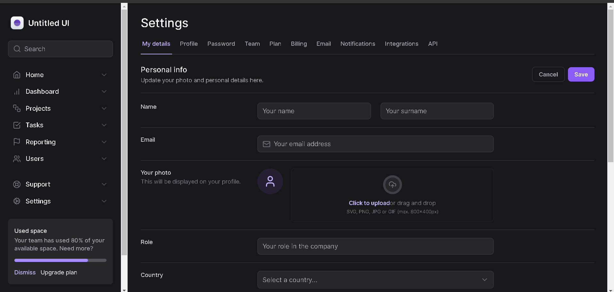

# Mastering TailwindCSS

<div align="center">
	
</div>

## :dart: Objetivo

Projeto desenvolvido com fins de estudo, com o intuito de aprimorar meus
conhecimentos em TailwindCSS.

## :hammer_and_wrench: Ferramentas

- [Frame Motion](https://www.framer.com/motion/)
- [Lucide React](https://lucide.dev/)
- [Next.js](https://nextjs.org/)
- [Radix](https://radix-ui.com/)
- [TailwindCSS](https://tailwindcss.com/)

## :desktop_computer: Padronização de código

- [EditorConfig](https://editorconfig.org/)
- [Eslint](https://eslint.org/)
- [Prettier](https://prettier.io/)

## :rocket: Executando o projeto

```bash
// Instale as dependências

npm i

// Concluindo a instalação rode

npm run dev
```
